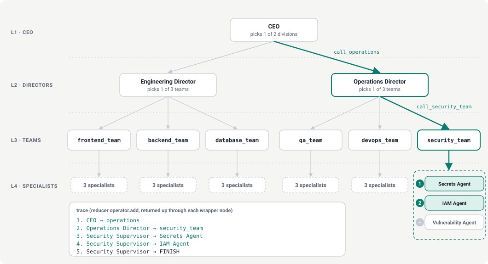
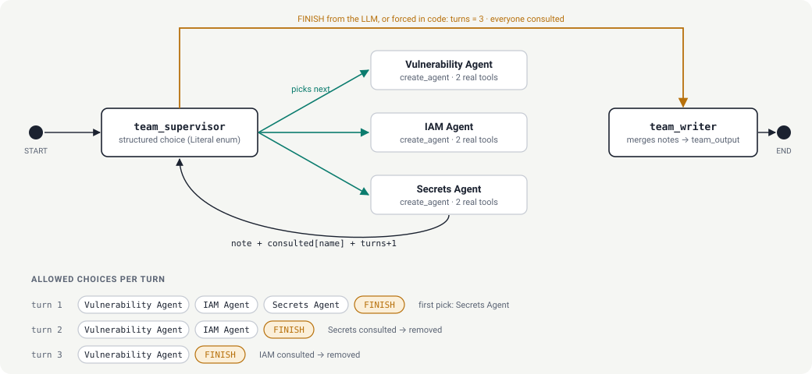
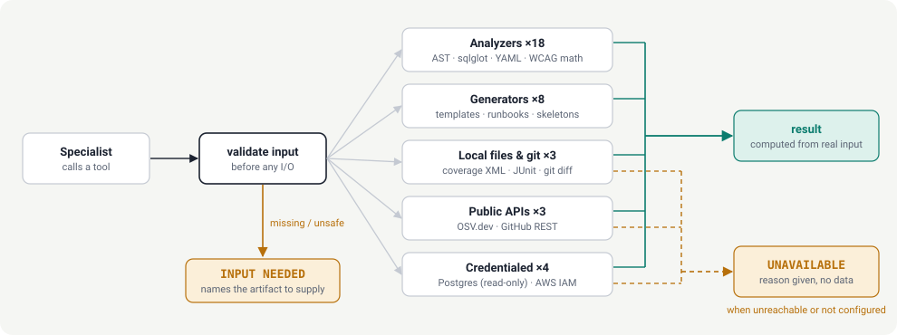
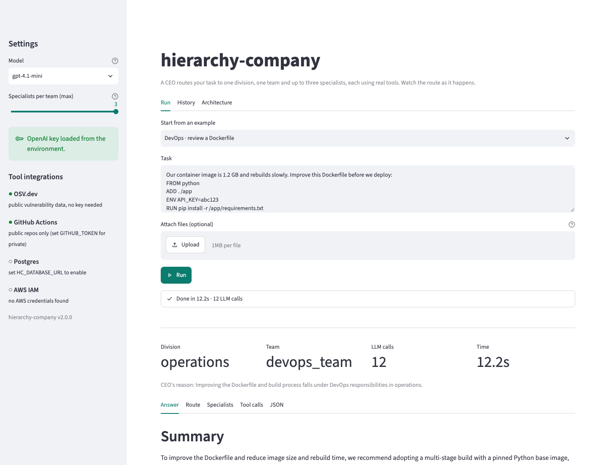
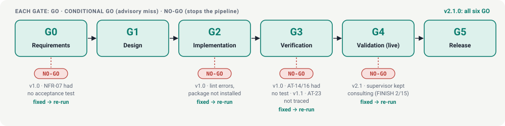

# hierarchy-company

**A 4-level hierarchical multi-agent system on LangGraph.** A CEO routes each task to one division director.
The director routes it to one of six teams. The team supervisor consults its specialists one at a time,
and each specialist calls **real tools**. Every decision is a structured choice, every loop has a limit
enforced in code, and every run returns a trace of the route it took.

| Version | SDLC gates | Unit tests | Coverage | Live OpenAI tests | Routing accuracy | LLM calls / run |
|---|---|---|---|---|---|---|
| **2.1.0** | **6 / 6 GO** | **159 passed** | **94%** | **42 passed** | **6 / 6** | **8–12** |

**Architecture page:** [abh2050.github.io/agent-org-chart](https://abh2050.github.io/agent-org-chart/) has the diagrams below in light and
dark mode, with the test results. It is served by GitHub Pages from [docs/index.html](docs/index.html).

---

## Contents

- [How it works](#how-it-works)
- [Web UI](#web-ui)
- [Quick start](#quick-start)
- [Tools](#tools)
- [Test results](#test-results)
- [How it was built: SDLC gates](#how-it-was-built-sdlc-gates)
- [Documentation](#documentation)
- [Configuration](#configuration)
- [Project layout](#project-layout)
- [Cost](#cost)
- [Known limits](#known-limits)
- [Extending](#extending)

---

## How it works

### One route through four levels



Each level picks exactly one child. A wrapper node (`call_operations`, `call_security_team`) maps parent state
into the child graph and returns only the child's new trace entries. Only one team, and at most 3 of the 18
specialists, work in any run.

| Level | Role | Count | Decides | Built by |
|---|---|---|---|---|
| L1 | CEO | 1 | which division | `graphs/company.py` |
| L2 | Division director | 2 | which team | `graphs/director.py` |
| L3 | Team supervisor + writer | 6 | next specialist, or FINISH | `graphs/team.py` |
| L4 | Specialist agent | 18 | which tools to call | `agents.py` (`create_agent`) |

| Division | Team | Specialists |
|---|---|---|
| engineering | frontend_team | React · UI · Accessibility |
| engineering | backend_team | API · Auth · Microservice |
| engineering | database_team | SQL · Schema · Query Optimization |
| operations | qa_team | Unit Test · Integration Test · Regression |
| operations | devops_team | Docker · Kubernetes · CI/CD |
| operations | security_team | Vulnerability · IAM · Secrets |

### Why the team loop always ends



The supervisor's structured-output schema only offers specialists that haven't been consulted yet, so the model
can't pick the same one twice. When the turn cap (3) is reached, or every specialist has been consulted, the code
routes to `team_writer` without calling the model.

### Real tools that fail honestly



No tool returns made-up data. Inputs are validated before any file, network or database access. When a tool
can't produce a result, it returns `INPUT NEEDED (...)` or `UNAVAILABLE (...)` with the reason, and the specialist
is instructed to report that instead of guessing.

---

## Web UI

```bash
uv pip install --python .venv/bin/python -e ".[ui]"
.venv/bin/hierarchy-company-ui               # opens http://localhost:8501
```



| Area | What it does |
|---|---|
| **Settings** (sidebar) | Choose the model and the maximum specialists per team. Shows whether an OpenAI key is loaded. A key pasted here stays in the browser session and is never displayed. |
| **Tool integrations** (sidebar) | Shows what the tools can reach right now: OSV.dev, GitHub, Postgres, AWS IAM |
| **Run** | Pick one of six examples or type a task, and attach files (Dockerfile, SQL, policy JSON, YAML, code). The route, tool calls and specialist reports stream in live while it runs. |
| **Results** | Division, team, LLM calls and time, then tabs for the answer, route, specialist notes, tool calls with their outputs, and a JSON download |
| **History** | Every run from the current session |
| **Architecture** | The four diagrams from this README |

The page sits on the same `stream_company()` API that you can use from Python:

```python
from hierarchy_company import build_company, stream_company, RunEvent

for item in stream_company("Review this IAM policy: {...}", build_company()):
    if isinstance(item, RunEvent):
        print(item.kind, item.text)        # route / tool_call / tool_result / note / ... / final
    else:
        print(item.llm_calls)              # the last item is the RunResult
```

---

## Quick start

```bash
uv venv --python 3.12 .venv
uv pip install --python .venv/bin/python -e ".[dev,postgres,aws]"
echo "OPENAI_API_KEY=sk-..." > .env          # git-ignored

# Ask a question
.venv/bin/hierarchy-company "An AWS key was committed to GitHub; assess the IAM blast radius and remediate."

# Give the specialists real artifacts to analyze
.venv/bin/hierarchy-company "Review this for security problems" --attach Dockerfile --attach k8s.yaml

# Machine-readable output, or the Mermaid diagrams for all 9 graphs
.venv/bin/hierarchy-company --json "Build a regression test plan for the payment module."
.venv/bin/hierarchy-company --graph
```

```python
from hierarchy_company import build_company, run_company

org = build_company()                                   # build once, reuse
result = run_company("Containerize our Flask app and deploy it to Kubernetes.", org)

result.division      # 'operations'
result.team          # 'devops_team'
result.trace         # ('CEO → operations', 'Operations Director → devops_team', ...)
result.llm_calls     # 12
result.final_answer  # Markdown with Summary / Details / Routing Path
```

---

## Tools

There are 36 tools, 2 per specialist. Each one computes its result from the input it receives, from a live source,
or from a documented template.

| Team | Specialist | Tools | Source |
|---|---|---|---|
| frontend | React | `lint_react_component`, `analyze_render_triggers` | JSX static analysis |
| frontend | UI | `audit_css_layout`, `generate_design_tokens` | CSS rules, HSL/WCAG math |
| frontend | Accessibility | `check_wcag_contrast`, `audit_html_accessibility` | WCAG 2.1 formula, HTML parser |
| backend | API | `validate_openapi_spec`, `design_rest_endpoints` | OpenAPI 3 rules, REST conventions |
| backend | Auth | `generate_jwt_config`, `inspect_jwt` | RFC 8725, JWT decoding |
| backend | Microservice | `map_service_dependencies`, `check_service_resilience` | docker-compose analysis |
| database | SQL | `analyze_sql_query`, `explain_sql_query` | sqlglot AST · **Postgres** (read-only) |
| database | Schema | `inspect_table_schema`, `suggest_indexes` | **Postgres** catalog · sqlglot |
| database | Query Optimization | `analyze_explain_plan`, `get_slow_query_stats` | EXPLAIN parser · **pg_stat_statements** |
| qa | Unit Test | `generate_unit_test_skeleton`, `measure_code_coverage` | Python AST · Cobertura XML |
| qa | Integration Test | `list_integration_points`, `create_test_fixture` | source scan · `httpx.MockTransport` template |
| qa | Regression | `find_changed_modules`, `get_flaky_test_history` | **git** · JUnit XML |
| devops | Docker | `scan_dockerfile`, `generate_dockerfile` | hadolint-style rules · template |
| devops | Kubernetes | `validate_k8s_manifest`, `generate_k8s_manifest` | manifest rules · template |
| devops | CI/CD | `generate_ci_pipeline`, `check_pipeline_status` | template · **GitHub REST API** |
| security | Vulnerability | `scan_dependencies`, `lookup_vulnerability` | **OSV.dev API** |
| security | IAM | `analyze_iam_policy`, `get_access_key_last_used` | policy analysis · **AWS IAM** (boto3) |
| security | Secrets | `scan_for_secrets`, `get_rotation_runbook` | provider patterns + entropy · runbooks |

**Bold** marks sources outside the process. OSV.dev and GitHub need no key. Postgres, AWS and private GitHub
repositories need the credentials listed under [Configuration](#configuration).

---

## Test results

Last full run: **2026-09-27**, on `gpt-4.1-mini`.

| Suite | What it proves | Tests | Result |
|---|---|---|---|
| Unit · tools | Each of the 36 tools gives the right answer on real inputs, fails honestly, and never touches the network on bad input | 89 | ✅ passed |
| Unit · graphs | Turn cap, no repeated specialist, one team per run, full 4-level trace order | 11 | ✅ passed |
| Unit · prompts, config, CLI | Routing prompts, enum schemas, settings validation, `--attach`, error handling | 38 | ✅ passed |
| Unit · stream + UI | Event order, no duplicate routes, tool events; the Streamlit page rendered with `AppTest`: run, history, errors, key never shown | 18 | ✅ passed |
| Unit · quality | No secrets in the source; `ruff` clean | 3 | ✅ passed |
| Live · company | Six reference tasks end to end | 6 | ✅ passed |
| Live · routing | CEO, director and supervisor decisions on 25 further tasks (the FINISH check runs 5 trials) | 25 | ✅ passed |
| Live · OpenAI | Auth, enum-constrained output, real tool calls, call counting | 6 | ✅ passed |
| Live · tool honesty | Computes from supplied data, asks for missing files, reports an unconfigured database | 4 | ✅ passed |
| Live · UI | The real Streamlit page runs the IAM example against OpenAI | 1 | ✅ passed |
| **Total** | | **201** | **201 passed** |

Unit coverage is 94% of 1,659 statements. `ruff` and `mypy` are clean. The Streamlit page itself is excluded from
coverage because `AppTest` executes it outside the tracer; its logic lives in `ui/services.py`, which is measured.
The page was also checked in a real browser (headless Chrome), and that run caught a bug the headless tests missed.
See the [changelog](CHANGELOG.md).

### Reference tasks (live, gate G4)

| ID | Task | Division | Team | LLM calls | Time |
|---|---|---|---|---|---|
| T1 | Our React checkout page fails WCAG contrast checks and re-renders too often. | engineering | frontend_team | 11 | 12.2s |
| T2 | Design a JWT-based auth flow for our REST API split into microservices. | engineering | backend_team | 11 | 14.1s |
| T3 | This Postgres query on the orders table takes 9 seconds; fix the schema/indexes. | engineering | database_team | 12 | 11.5s |
| T4 | Build a regression test plan for the payment module before release. | operations | qa_team | 10 | 10.7s |
| T5 | Containerize our Flask app and deploy it to Kubernetes with a CI/CD pipeline. | operations | devops_team | 12 | 14.1s |
| T6 | An AWS key was committed to GitHub; assess the IAM blast radius and remediate. | operations | security_team | 8 | 10.0s |

In every run the final answer had all three sections (Summary, Details, Routing Path), no specialist was consulted
twice, and no answer claimed an action had been carried out. Per-run traces and answers are in
`reports/e2e_results.json`.

### Run the tests

```bash
.venv/bin/python -m pytest                          # offline unit suite (no API key needed)
.venv/bin/python -m pytest tests/e2e -m live        # 42 live tests against OpenAI (~2 min, ~100 LLM calls)
```

---

## How it was built: SDLC gates



The project was built gate by gate. `python -m gates` runs each phase's checks in order, records a decision, and
stops at the first **NO-GO**. A gate can only start once the previous gate has a recorded GO.

| Gate | Phase | Blocking checks | Advisory |
|---|---|---|---|
| G0 | Requirements | Every FR/NFR maps to an acceptance test | — |
| G1 | Design | Module map, state contracts, sequence, ADRs, failure modes | — |
| G2 | Implementation | Matches the design module map; `ruff` clean; imports without a key; all 9 graphs compile; registry is 1/2/6/18 | `mypy` |
| G3 | Verification | Unit tests pass with coverage ≥ 85%; all 28 acceptance tests referenced by a test | — |
| G4 | Validation (live) | Division routing 6/6; ≤ 20 LLM calls per run; complete answers; no repeated specialist; no claims of completed actions | Team routing ≥ 5/6 |
| G5 | Release | Docs present; version matches everywhere; `.env` git-ignored; no secrets in the tree | — |

**NO-GO decisions during the build.** Each was fixed and the gate re-run.

| Version | Gate | Cause | Fix |
|---|---|---|---|
| 1.0 | G0 | NFR-07 had no acceptance test | Added AT-20 (static quality test) |
| 1.0 | G2 | Lint errors; package not installed | Fixed lint; installed after adding README |
| 1.0 | G3 | AT-14 and AT-16 had no test | Wrote the live E2E suite |
| 1.1 | G3 | AT-23 not referenced by any test | Traced it in the test module |
| 2.1 | G4 | Flaky live test: the supervisor kept consulting after the notes covered the task (FINISH in 2 of 15 trials) | Added a coverage rule to the prompt and put `reason` before `choice`: 15 of 15 trials. The gate now names failing tests. |

```bash
.venv/bin/python -m gates                 # all gates in order (G4 calls OpenAI)
.venv/bin/python -m gates --only G3       # one gate; the previous gate must have a recorded GO
.venv/bin/python -m gates --from G4       # resume from a gate
```

Decisions are written to [docs/gate_log.md](docs/gate_log.md) and `reports/gate_report.json`.

---

## Documentation

| Document | Contents |
|---|---|
| [PROMPT.md](PROMPT.md) | The system prompt: engineering standards, architecture, gate definitions |
| [docs/01_requirements.md](docs/01_requirements.md) | 20 functional and 9 non-functional requirements, each mapped to one of 28 acceptance tests |
| [docs/02_design.md](docs/02_design.md) | Module map, state contracts, sequence diagram, 12 architecture decisions, failure modes |
| [docs/gate_log.md](docs/gate_log.md) | Latest decision and evidence for every gate (generated) |
| [docs/index.html](docs/index.html) | The architecture page, served at [abh2050.github.io/agent-org-chart](https://abh2050.github.io/agent-org-chart/) |
| [CHANGELOG.md](CHANGELOG.md) | Release notes for 1.0.0 through 2.1.0 |

To regenerate the diagrams and the architecture page, run `python docs/diagrams/build.py`.

---

## Configuration

| Variable | Default | Purpose |
|---|---|---|
| `OPENAI_API_KEY` | — | Required for live runs |
| `HC_MODEL` | `gpt-4.1-mini` | Chat model for every level |
| `HC_TEMPERATURE` | `0.0` | Sampling temperature |
| `HC_MAX_SPECIALIST_TURNS` | `3` | Specialist calls per team (enforced in code) |
| `HC_SPECIALIST_RECURSION_LIMIT` | `12` | Limit on each specialist's tool-call rounds |
| `HC_GRAPH_RECURSION_LIMIT` | `50` | Recursion limit for the parent graph |
| `HC_REQUEST_TIMEOUT` | `60` | Seconds per OpenAI request |
| `HC_MAX_RETRIES` | `2` | Retries on 429, 5xx and timeouts |
| `HC_DATABASE_URL` | — | Enables the read-only Postgres tools |
| `GITHUB_TOKEN` | — | Raises GitHub rate limits and allows private repositories |
| AWS credentials | — | boto3 default chain; enables `get_access_key_last_used` |

---

## Project layout

```
src/hierarchy_company/
  config.py          Settings from HC_* environment variables, validated
  llm.py             get_model(): the only place a chat model is created
  registry.py        Org chart as data: divisions → teams → specialists → tools
  tools/             36 real tools, one module per team, plus _common.py helpers
  prompts.py         Every prompt, as pure functions
  routing.py         Literal-enum decision schemas and node ids
  agents.py          make_specialist() → create_agent
  state.py           TeamState / DirectorState / CompanyState contracts
  graphs/            team.py (L3) · director.py (L2) · company.py (L1)
  factory.py         build_company(): composition root with dependency injection
  observability.py   LLMCallCounter callback
  runner.py          stream_company() → RunEvents + RunResult; run_company()
  cli.py             hierarchy-company console script
  ui/                Streamlit app (app.py), its logic (services.py), launcher
gates/               SDLC gate engine (python -m gates)
docs/                Requirements, design, gate log, architecture page, diagrams
tests/unit/          159 offline tests (a scripted test model stands in for OpenAI)
tests/e2e/           42 live tests (-m live)
reports/             Latest gate report and live results (generated)
```

---

## Cost

| Step | LLM calls per run |
|---|---|
| CEO routing | 1 |
| Director routing | 1 |
| Supervisor decisions | up to 3 (the final FINISH is forced in code without a call) |
| Specialists | up to 3 agents × (1 + tool rounds), usually 2 each |
| Team writer, director review, CEO answer | 3 |
| **Measured** | **8–12** (ceiling of 20, checked at G4) |

To reduce cost, you can:
- Set `HC_MAX_SPECIALIST_TURNS=2`.
- Pass a cheaper model for routing via `build_company(model=...)`.
- Skip the team writer when there is only one note.

---

## Known limits

- **Postgres and AWS IAM tools** are tested only with simulated responses and a refused connection. They have not
  run against a real database or AWS account.
- **Answer quality isn't graded.** The tests check routing, limits, structure and honesty, not whether the advice
  is correct. There is no scored golden set or repeated-run consistency check yet.
- **The six reference tasks include no files**, so in those runs specialists mostly ask for artifacts. Analysis
  quality is covered by the tool unit tests and the live honesty tests.
- **It runs locally as a library, CLI and single-user Streamlit app.** There is no authentication on the UI,
  and no HTTP API, tracing, or cost ceiling enforced at runtime. Don't expose the UI on a network as it is.

---

## Extending

- **Add a team or specialist:** add a `TeamSpec` or `SpecialistSpec` in `registry.py`. The graphs are generated from it.
- **Add a tool:** implement it in `tools/<team>.py`. Validate inputs before any external call, return
  `unavailable()` or `needs_input()` instead of guessing, and add a network-isolated unit test.
- **Use a different model:** pass any LangChain `BaseChatModel` to `build_company(model=...)`.
- **Ship a change:** update the requirements and design docs first, then run `python -m gates` until every gate is GO.
