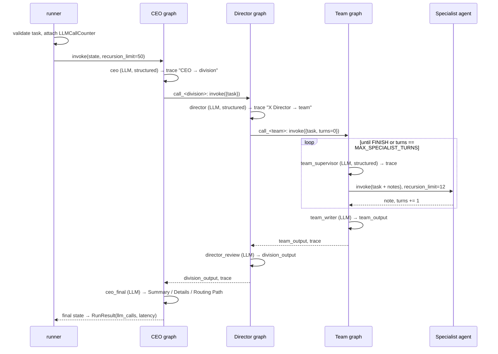

# 02 · Design Specification (Gate G1)

This design traces to `docs/01_requirements.md`. The requirement IDs in brackets link each design element to what it satisfies.

## 1. Architecture overview

```
                       ┌──────────────────────────────┐
  run_company(task) ──►│ L1 company_graph (CEO)       │  ceo → call_<division> → ceo_final
                       └──────────────┬───────────────┘
                     ┌────────────────┴───────────────┐
             ┌───────▼────────┐               ┌───────▼────────┐
             │ L2 engineering │               │ L2 operations  │  director → call_<team> → director_review
             └───────┬────────┘               └───────┬────────┘
          ┌──────────┼──────────┐          ┌──────────┼──────────┐
       frontend   backend   database       qa      devops   security   L3 team graphs
          │  team_supervisor ⇄ specialist nodes (≤ MAX_SPECIALIST_TURNS) → team_writer
          ▼
       L4 specialist agents: create_agent(model, 2 real tools)          (18 total)
```

**Layering rule:** every module depends only on modules in the same row or the rows below it. Nothing depends upward.

```
cli ─► runner ─► factory ─► graphs/{company,director,team} ─► agents, routing, prompts, state
                     │                                    └─► registry ─► tools/*
                     └─► llm ─► config          observability (callbacks) ◄─ runner
```

## 2. Module map

| Module | Responsibility | Satisfies |
|---|---|---|
| `src/hierarchy_company/__init__.py` | Public API (`run_company`, `build_company`, `RunResult`, `Settings`) and `__version__` | FR-12 |
| `src/hierarchy_company/config.py` | `Settings`: typed, validated and read from `HC_*` environment variables. Loads `.env` unless `HC_DISABLE_DOTENV` is set. | NFR-04, NFR-05 |
| `src/hierarchy_company/llm.py` | `get_model(settings)`: the only place a `ChatOpenAI` is created | NFR-01 |
| `src/hierarchy_company/registry.py` | The org chart as immutable data: `Org`, `DivisionSpec`, `TeamSpec`, `SpecialistSpec`, plus lookups | FR-01 |
| `src/hierarchy_company/tools/__init__.py` | Re-exports the tool modules | FR-02 |
| `src/hierarchy_company/tools/_common.py` | Shared helpers: `unavailable()`, `http_get_json`/`http_post_json` (timeouts), YAML parsing, finding formatting | FR-17, NFR-09 |
| `src/hierarchy_company/tools/frontend.py` | Real tools: JSX lint, render triggers, CSS audit, design tokens, WCAG contrast, HTML a11y audit | FR-02 |
| `src/hierarchy_company/tools/backend.py` | Real tools: OpenAPI validation, REST design, JWT config/inspection, compose dependencies/resilience | FR-02 |
| `src/hierarchy_company/tools/database.py` | Real tools: sqlglot SQL analysis, index derivation, EXPLAIN parsing; read-only Postgres integration | FR-02 |
| `src/hierarchy_company/tools/qa.py` | Real tools: AST test skeletons, Cobertura coverage, integration-point scan, fixtures, git churn, JUnit flakiness | FR-02 |
| `src/hierarchy_company/tools/devops.py` | Real tools: Dockerfile/K8s linting and generators, CI workflow generator, GitHub Actions status | FR-02 |
| `src/hierarchy_company/tools/security.py` | Real tools: OSV.dev dependency/vulnerability lookups, IAM policy analysis, AWS key usage, secret scanning, runbooks | FR-02 |
| `src/hierarchy_company/prompts.py` | All prompt templates as pure functions (no LLM access) | FR-03, FR-11 |
| `src/hierarchy_company/routing.py` | `make_route_schema` (a `Literal` schema per decision point), `node_id` and `FINISH` | FR-04, FR-07, FR-09 |
| `src/hierarchy_company/agents.py` | `make_specialist` factory and the `AgentFactory` protocol | FR-03 |
| `src/hierarchy_company/state.py` | `TeamState`, `DirectorState` and `CompanyState` TypedDicts (the state contracts) | FR-10 |
| `src/hierarchy_company/graphs/__init__.py` | Re-exports the graph builders | — |
| `src/hierarchy_company/graphs/team.py` | `build_team_graph(team, model, settings, agent_factory)` (L3) | FR-04, FR-05, FR-06 |
| `src/hierarchy_company/graphs/director.py` | `build_director_graph(division, team_graphs, model)` (L2) | FR-07, FR-08 |
| `src/hierarchy_company/graphs/company.py` | `build_company_graph(director_graphs, model)` (L1) | FR-09 |
| `src/hierarchy_company/factory.py` | `build_company(model=None, settings=None, agent_factory=...)`, which returns an `Organization` holding all 9 graphs | NFR-01 |
| `src/hierarchy_company/observability.py` | `LLMCallCounter` callback, which counts chat-model calls across nested graphs | FR-12, NFR-03 |
| `src/hierarchy_company/runner.py` | `stream_company` yields `RunEvent`s from `graph.stream(subgraphs=True)`. `run_company` consumes it and returns a `RunResult`. Validates input and applies the recursion limit. | FR-12, FR-19, NFR-02, NFR-06 |
| `src/hierarchy_company/cli.py` | `hierarchy-company` console entry point | FR-13 |
| `src/hierarchy_company/ui/__init__.py` | UI package marker | FR-20 |
| `src/hierarchy_company/ui/services.py` | Framework-free UI logic: org construction, attachments, integration status, event formatting | FR-20 |
| `src/hierarchy_company/ui/app.py` | The Streamlit page (layout and widgets only) | FR-20 |
| `src/hierarchy_company/ui/launcher.py` | `hierarchy-company-ui` entry point that runs `streamlit run` on the app | FR-20 |

## 3. State contracts

```python
class TeamState(TypedDict):            # L3
    task: str
    specialist_notes: Annotated[list[str], operator.add]
    next_specialist: str
    turns: int
    team_output: str
    consulted: Annotated[list[str], operator.add]   # v1.1 (FR-15): specialists already called
    trace: Annotated[list[str], operator.add]

class DirectorState(TypedDict):        # L2
    task: str
    selected_team: str
    reason: str
    team_output: str
    division_output: str
    trace: Annotated[list[str], operator.add]

class CompanyState(TypedDict):         # L1
    task: str
    selected_division: str
    ceo_reason: str
    selected_team: str                 # surfaced from L2 so RunResult can report it (FR-12)
    division_output: str
    trace: Annotated[list[str], operator.add]
    final_answer: str
```

**Boundary mapping** (each wrapper node `call_<child>` does this):

| Parent → child input | Child → parent output |
|---|---|
| `task`, plus empty defaults (`trace=[]`) | L3→L2: `team_output`, `trace` (new entries only) |
| | L2→L1: `division_output`, `selected_team`, `trace` (new entries only) |

The child starts with an empty trace. Because the reducer is `operator.add`, the parent appends the child's entries exactly once [FR-10].

**Routing schemas** [FR-04, FR-07, FR-09]: `make_route_schema(name, options)` creates a Pydantic model with fields `choice: Literal[*options]` and `reason: str`. The schema itself rejects out-of-set values, and OpenAI structured output receives an `enum`.

## 4. Sequence (one run)



## 5. Architecture decisions (ADRs)

| ADR | Decision | Alternatives | Rationale |
|---|---|---|---|
| ADR-01 | Invoke child graphs from **wrapper nodes**, not as native subgraph nodes | Add the compiled subgraph as a node | Each level has a different state schema, so explicit mapping keeps the boundaries visible and testable. This matches the Section 6 teaching style. |
| ADR-02 | **Dependency injection** of the model and agent factory into every builder | Module-level `model` global | Offline unit tests with fakes [NFR-01]. Swapping models needs no code change. |
| ADR-03 | The org chart is **data** (`registry.py`), and the graphs are generated from it | Hand-written graph per team | One factory builds 6 teams and 2 directors. Adding a team is a data change. |
| ADR-04 | The turn cap is enforced **twice**: the supervisor short-circuits (no LLM call) and the route function guards | Prompt-only limit | Termination is guaranteed whatever the LLM outputs [FR-05, NFR-02], and the forced decision costs nothing. |
| ADR-05 | Dynamic `Literal` schemas via `pydantic.create_model` | Free-text choice with fuzzy matching | Invalid routes are impossible at the schema level [FR-04]. |
| ADR-06 | LLM calls are counted with a **callback handler** propagated through the config | Wrap the model | It works across nested graphs and agents without touching business code [NFR-03]. |
| ADR-08 | **No-repeat is enforced through a per-turn schema**: the supervisor's `Literal` offers only unconsulted specialists plus FINISH (cached per remaining set) | A prompt rule only (v1.0); rejecting and retrying | v1.0 live runs re-picked Kubernetes Agent despite the prompt rule. Narrowing the enum makes a repeat impossible and costs nothing extra. |
| ADR-09 | **Recommendation-only output contract**: every summarizing prompt states that nothing was executed | Post-filtering the text | The tools are read-only or advisory, so claiming an action was completed is a correctness bug. Fixing the prompt at the source is simplest. G4 measures it. |
| ADR-10 | **Real tools in three tiers.** (1) Local analyzers over supplied artifacts: rules, `ast`, `sqlglot`, YAML, HTML parsing, WCAG math. (2) Public no-key APIs: OSV.dev, GitHub REST. (3) Credentialed integrations: Postgres via `HC_DATABASE_URL`, AWS IAM via the boto3 default chain. | Keep mocks; require every integration | Removes fabricated data while keeping the system usable offline. Tier 3 degrades to an explicit UNAVAILABLE (FR-17). |
| ADR-11 | Generators (Dockerfile, K8s, CI, JWT config, runbooks, test skeletons) are allowed as tools | LLM free-text generation | They are deterministic, reviewable templates grounded in documented best practice, not fake observations. |
| ADR-12 | The UI is a **thin Streamlit layer over `stream_company`**, with its logic in `ui/services.py` | A separate API server plus a JS frontend | One process with no new infrastructure. Live progress comes from LangGraph's nested `subgraphs=True` stream. The logic is unit-testable without a browser, and the page is tested with `streamlit.testing.AppTest`. |
| ADR-07 | A gate engine (`python -m gates`) makes the SDLC decisions from automated evidence | Manual checklist | Decisions are repeatable and auditable (`reports/gate_report.json`). |

## 6. Failure modes

| Failure | Detection | Handling |
|---|---|---|
| LLM never chooses FINISH | `turns >= MAX_SPECIALIST_TURNS` | Short-circuit to `team_writer` [ADR-04] |
| LLM re-picks a consulted specialist | Not possible: removed from the enum | All consulted → forced FINISH [ADR-08] |
| External tool source down or unconfigured | Exception, non-2xx response or missing configuration | Tool returns `UNAVAILABLE (…)`. The specialist reports it (FR-17). |
| Specialist tempted to invent inputs | — | Prompt forbids it (FR-18). The team writer only merges what the notes contain. |
| OpenAI slow or failing transiently | Client timeout / 5xx / 429 | `max_retries` with backoff; then the error propagates [NFR-08] |
| Specialist tool loop spins | `GraphRecursionError` inside the agent | Record a soft-failure note and continue |
| LLM returns an invalid route | Pydantic validation in structured output | Cannot happen with an `enum` schema. A retry is raised by the client. |
| Empty task | `runner` validation | `ValueError` before any LLM call [NFR-06] |
| Missing API key | Raised by the OpenAI client at first call | Import and build still work [NFR-01]. The CLI exits with a clear message. |
| Parent graph loops | `recursion_limit=50` | `GraphRecursionError` propagates. It cannot happen by construction, because L1 and L2 are DAGs. |

## 7. Test strategy

- **Unit (offline):** a `FakeChatModel` scripts structured decisions and text replies, and `FakeAgent` replaces `create_agent`. These tests cover AT-01 to AT-13, AT-15, AT-17 to AT-20.
- **E2E (live, `-m live`):** the 6 reference tasks against `gpt-4.1-mini`. These cover AT-09, AT-14 and AT-16, and the results are written to `reports/e2e_results.json` for gate G4.
